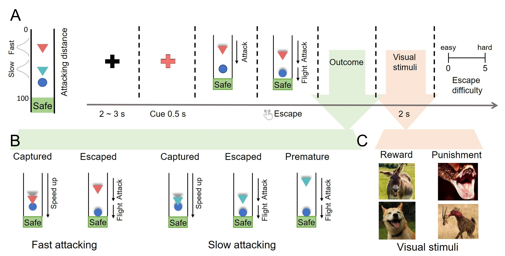

# sEEG-slow-fast-attack    

[](https://doi.org/10.1101/2024.01.16.575785)
[
](https://twitter.com/ANDlab3)


> From [Affective, Neuroscience, and Decision-making Lab](https://andlab-um.com)


## Description
Code and data for: 'An intracranial dissection of human escape circuits'.
preprint: [https://doi.org/10.1101/2024.01.16.575785](https://doi.org/10.1101/2024.01.16.575785)

## Abstract
Predators attack at different spatiotemporal scales, spurring prey to elicit escape responses that range from simple motor reactions and strategic planning that involve more complex cognitive
processes. Recent work in humans suggests that escape relies on two distinct circuits: the reactive and cognitive fear circuits. However, the specific involvement of these two circuits in different
stages of human escaping remains poorly characterized. In this study, we recorded intracranial electroencephalography (iEEG) from epilepsy patients while they performed a modified flight
initiation distance (FID) task. We found brain regions in the cognitive fear circuit, including the ventromedial prefrontal cortex and hippocampus, encoded the threat level during the information
processing stage. The actual escaping stage, especially under rapid attack, prominently activated areas within the reactive fear circuit, including the midcingulate cortex and amygdala. Furthermore,
we observed a negative correlation between the high gamma activity (HGA) of the amygdala and the HGA of the vmPFC and HPC under rapid attacks. This indicates that the amygdala may
suppress the activity of the cognitive fear circuit under rapid attacks, enabling the organism to react quickly to ensure survival under the imminent threat. These findings highlight the distinct
roles of the reactive and cognitive fear circuits in human escaping and provide accounts for the importance of fear in human survival decisions.

## Experiment

During intracranial recordings, participants performed a modified FID task. In this task, participants were instructed to imagine themselves as prey and need to escape from the predator,
during which they were also instructed to escape as late as possible to obtain more survival resources. The predator would initially move slowly toward the prey and then attack (accelerate)
at a random distance, which varied depending on two predator types: fast-attacking predators vs. slow-attacking predators. Fast-attacking predators would initiate the attack from a greater distance,
which requires the participants to make quick escape decisions. Slow-attacking predators would initiate the attack from a shorter distance, allowing for more time and a larger buffer zone to escape. In fast attacking conditions, the potential outcomes are capture and successful escape. Under slow-attacking conditions, the potential outcomes include capture, successful escape, and premature escape. Participants will receive rewarding or punishing stimuli based on their escape success.

## Data path and analysis


## Notes
If you want to run the code, pay attention to the environment configuration and the file path.

> package required:
> Python

```bash
mne
numpy
scipy
pandas
nibabel
matplotlib  
```

