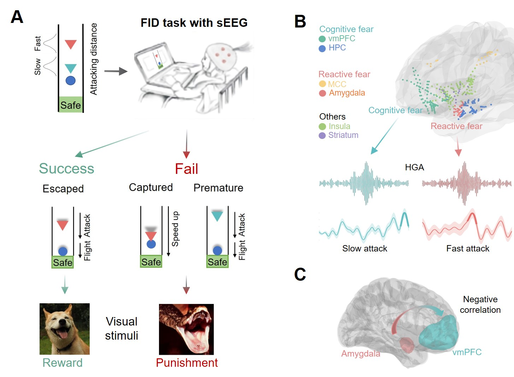

# sEEG-slow-fast-attack    

> From [Affective, Neuroscience, and Decision-making Lab](https://andlab-um.com)

## Description
Code and data for: 'An intracranial dissection of human escape circuits'.
preprint: [https://doi.org/10.1101/2024.01.16.575785](https://doi.org/10.1101/2024.01.16.575785)

## Experiment

## Data path and analysis

## REFERENCES
preprint: [https://doi.org/10.1101/2024.01.16.575785](https://doi.org/10.1101/2024.01.16.575785)

## Notes
If you want to run the code, pay attention to the environment configuration and the file path.

> package required:

